# Ph-UI!!!

[Lab4b.](#part-g)

For lab this week, we focus both on sensing, to bring in new modes of input into your devices, as well as prototyping the physical look and feel of the device. You will think about the physical form the device needs to perform the sensing as well as present the display or feedback about what was sensed. 

## Lab Overview

A) [Capacitive Sensing](#part-a)

B) [OLED screen](#part-b) 

C) [Paper Display](#part-c)

D) [Materiality](#part-d)

E) [Servo Control](#part-e)

F) [Camera Test](#part-f)

G) [Record the interaction](#part-g)

## The Report (Part 1: A-D, Part 2: E-F)

### Part A

Tried out and tested with different sensors and components in kit, including [capacitive sensor](https://learn.adafruit.com/adafruit-mpr121-gator), [proximity sensor (Adafruit APDS-9960)](https://www.adafruit.com/product/3595), [Adafruit rotary encoder](https://www.adafruit.com/product/4991#technical-details), [joystick](https://www.sparkfun.com/products/15168), and [distance sensor (Sparkfun Proximity Sensor Breakout)](https://www.sparkfun.com/products/15177)

### Part B

### Part C
### Physical considerations for sensing

**\*\*\* 5 sketches of different ways you might use your sensor, and how the larger device needs to be shaped in order to make the sensor useful.\*\*\***

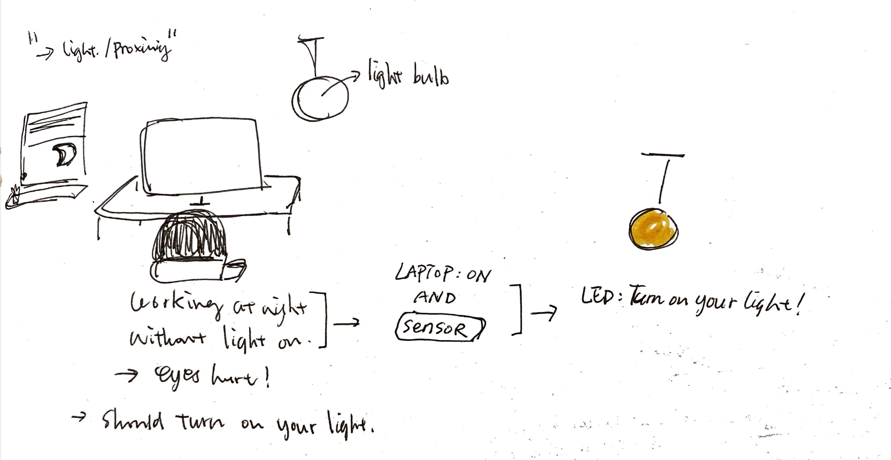
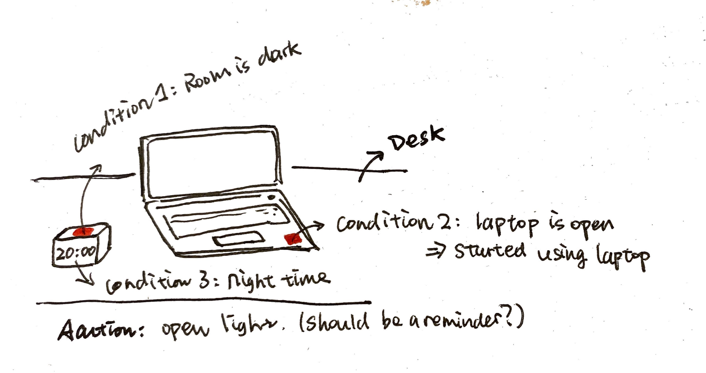

### Part D
### Physical considerations for displaying information and housing parts

LAB PART 2

### Part 2

### Part F (Optional)

### Part G

### Record

Document all the prototypes and iterations you have designed and worked on! Again, deliverables for this lab are writings, sketches, photos, and videos that show what your prototype:
* "Looks like": shows how the device should look, feel, sit, weigh, etc.
* "Works like": shows what the device can do
* "Acts like": shows how a person would interact with the device
* Draft sketches (moved from Part D.)
  - 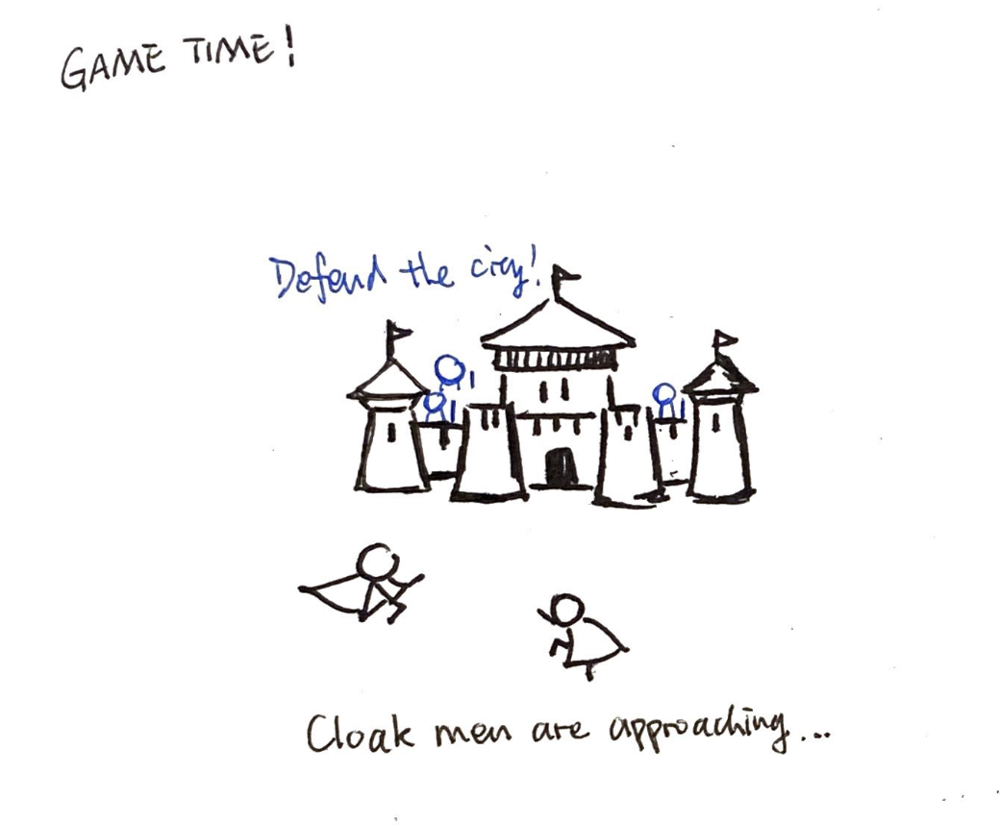
  - 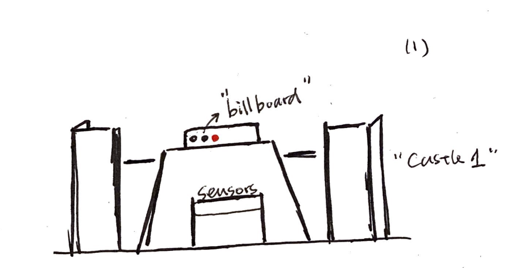
  - 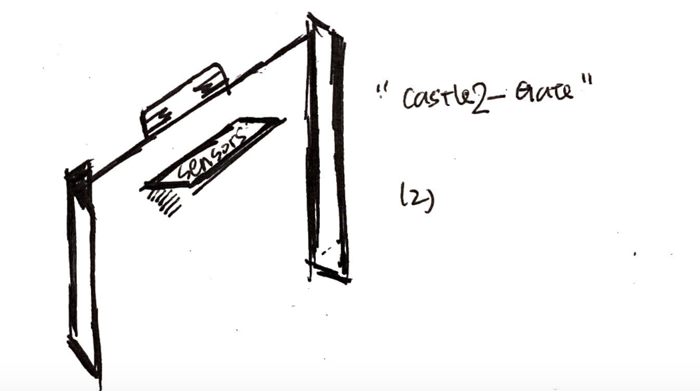
  - 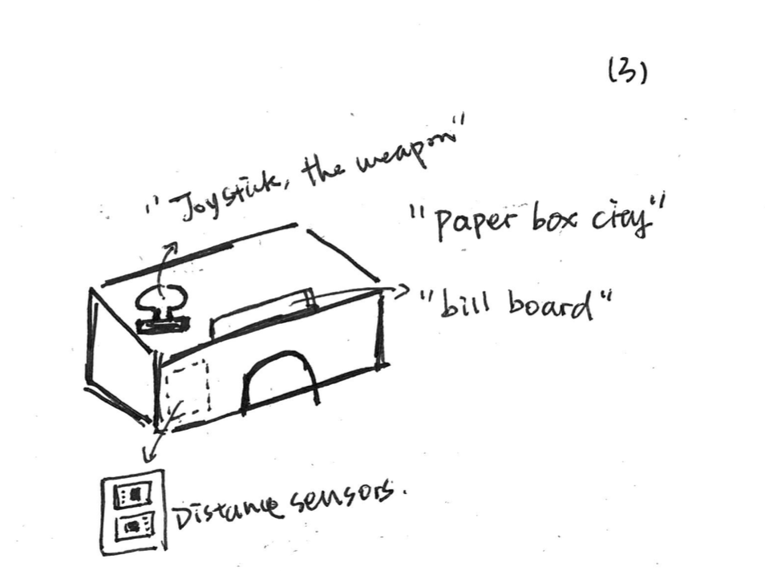
  - 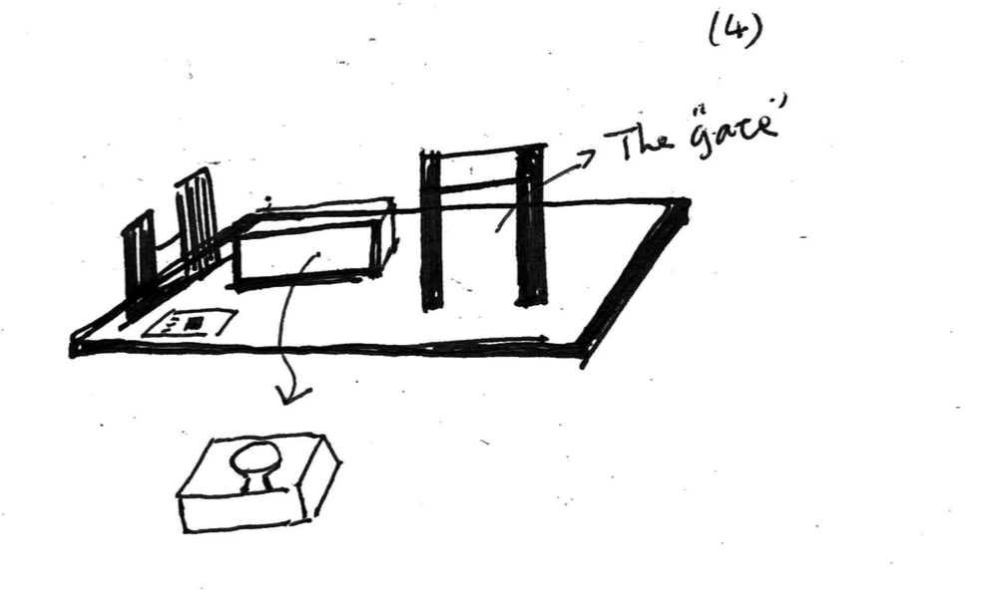
* The architecture
  - Beforehand, I tried cardboard and small paper boxes to host the joystick, the OLED display, and the sensor separately.
  - A full architecture might bring more fun.
  - I reduild a part of a Lego model. Specifically, designed some space using the Lego blocks to host the sensors and devices to prototype the physical game field.
  - The Player will stand behind the forte
    
    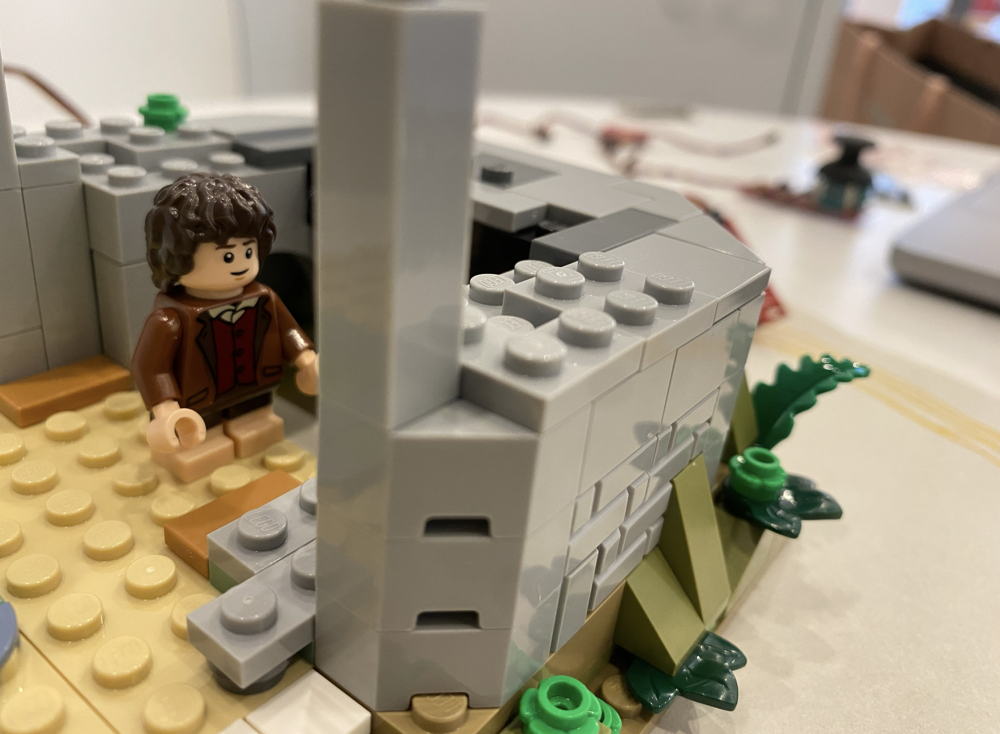
  - The sensor is placed at the gate to detect the intruders.
    
    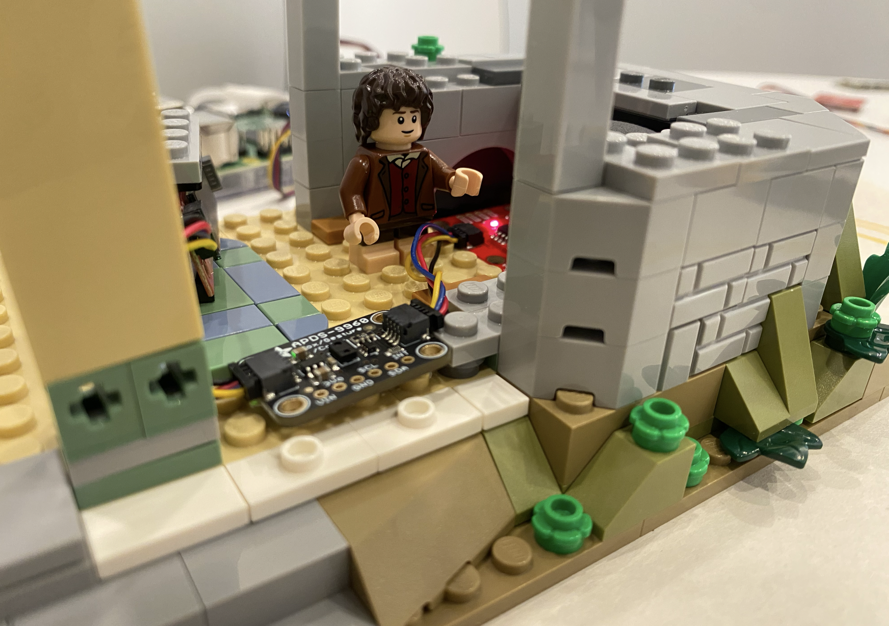
  - The OLED display is placed at a monitor hold.
    
    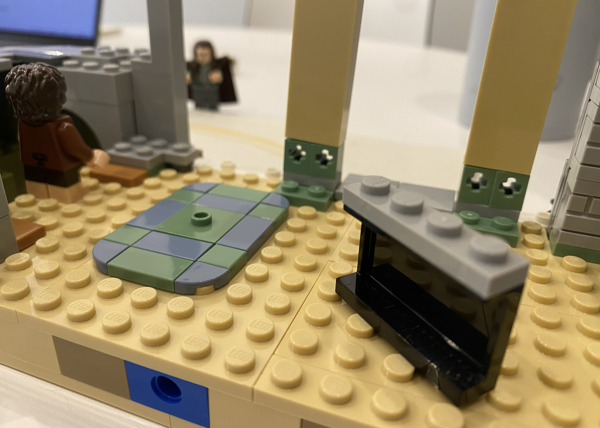
    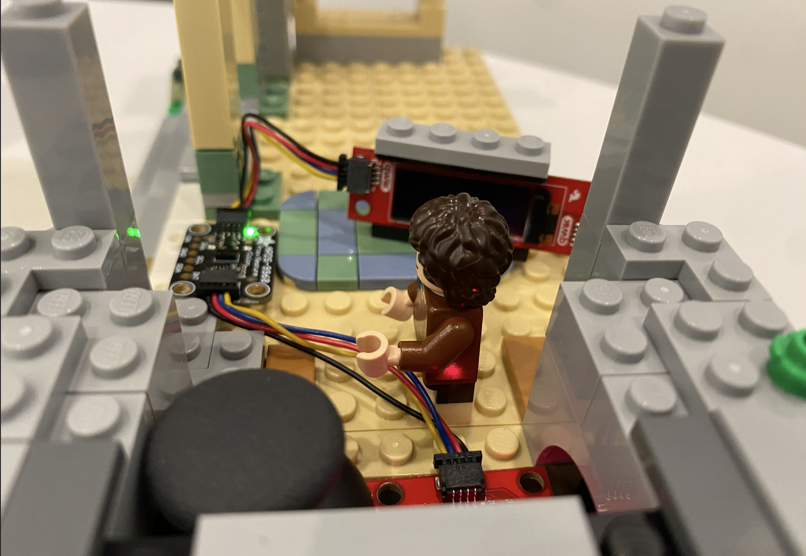
  - To let the game make more sense, the joystick, together with the player, hide behind the forte.
    
    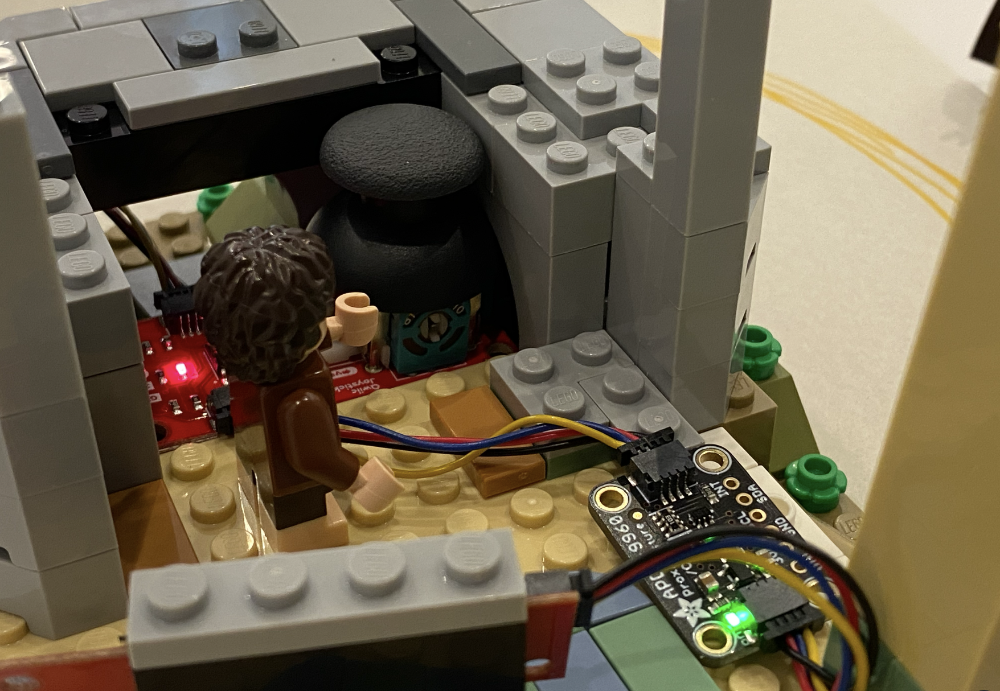
    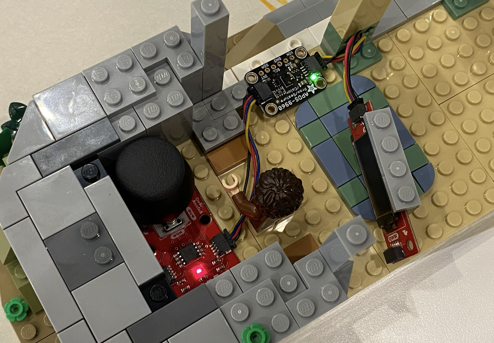

* The design diagram

  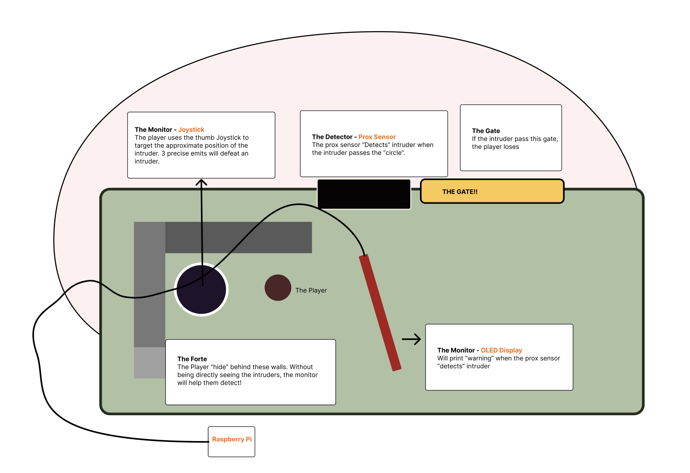
  
* The game

  - Defeat the approaching intruder by direct your bullets toward them using the Joystick.
    
  - Three+ precise attacks using the Joystick on the intruder that is “close” to you.
    
  - Defeat the intruder, you will win!!
    
  - Different members of the intruding army has different ability. Be careful. Someone takes much longer to defeat.
    
[Video Demo Link](https://drive.google.com/file/d/1wu_QEWYs669UqLiSY8HTz5xt0zNIm1aZ/view?usp=sharing)

Code file: defend.py

